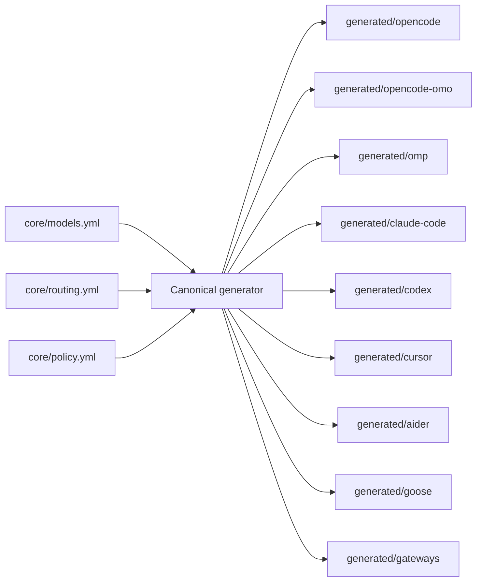
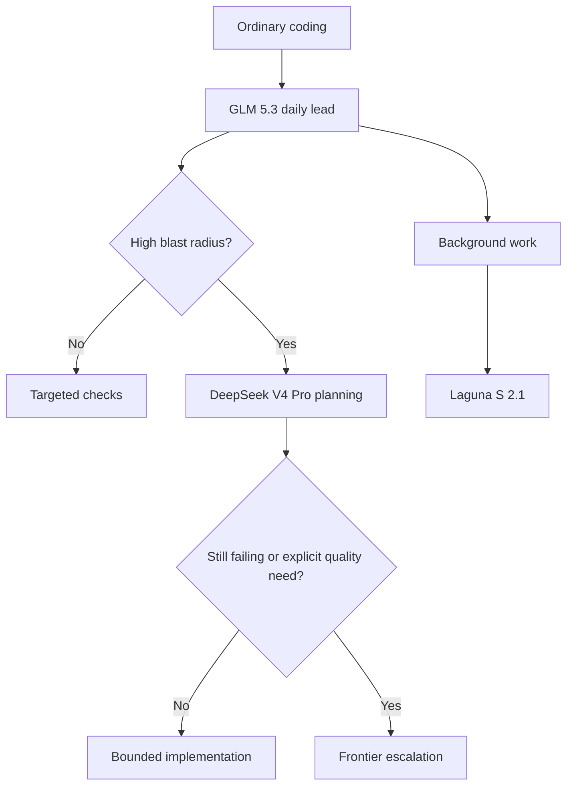
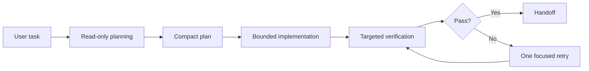

# Universal Agent Config

[](https://github.com/jesseoue/universal-agent-config/actions/workflows/ci.yml)
[](https://github.com/jesseoue/universal-agent-config/actions/workflows/model-drift.yml)
[](https://github.com/jesseoue/universal-agent-config/releases)
[](LICENSE)
[](https://github.com/jesseoue/universal-agent-config/issues)
[](https://github.com/jesseoue/universal-agent-config/issues?q=is%3Aissue+is%3Aopen+label%3A%22good+first+issue%22)
[](https://github.com/jesseoue/universal-agent-config/stargazers)

**One config. Seven coding agents. Five routing technologies.**

Universal Agent Config keeps model routing, fallbacks, permissions, and prompts in one canonical repo, then generates native configs for OpenCode, omp, Claude Code, Codex, Cursor, Aider, and Goose.

| | |
| --- | --- |
| **Agents** | OpenCode · OpenCode + optional OMO · omp · Claude Code · Codex · Cursor · Aider · Goose |
| **Routing** | OpenRouter · Cloudflare · Vercel · LiteLLM · Portkey |
| **Taxonomy** | Model gateways · model providers · media providers · inference runtimes |
| **Trust** | CI · daily model drift detection · sandboxed install tests · secret scan |
| **Install** | User-local · dry-run · backups · uninstall · doctor |
| **Tools** | Native tools · MCP · plugins · provider-aware semantics |
| **Community** | [Contributing](CONTRIBUTING.md) · [Security](SECURITY.md) · [Architecture](docs/architecture.md) · [Wiki](docs/wiki.md) · [Discussions](https://github.com/jesseoue/universal-agent-config/discussions) |

## 30-second start

Try the web generator first:

[https://universal-agent-config.leadmagic.sh](https://universal-agent-config.leadmagic.sh)

Then use the repository when you want to manage canonical policy directly:

```bash
git clone https://github.com/jesseoue/universal-agent-config.git
cd universal-agent-config
./scripts/install.sh --agent opencode
./scripts/install.sh doctor
```

Then set your OpenRouter key:

```bash
export OPENROUTER_API_KEY=sk-or-...
```

Add another agent without duplicating policy:

```bash
./scripts/install.sh --agent claude-code
./scripts/install.sh --agent codex
./scripts/install.sh --agent goose
```

Preview everything before touching your machine:

```bash
./scripts/install.sh --agent opencode --dry-run
```

Remove the symlinks later:

```bash
./scripts/install.sh uninstall
```

## Why developers star this

- Stop maintaining seven copies of the same AI model routing policy.
- Change one canonical model lane and regenerate every native agent config.
- Model metadata is refreshed from the live OpenRouter catalog, not guessed.
- Daily drift detection catches model changes before your coding agent does.
- Clean user-local install: no root, backups, dry-run, doctor, and uninstall.
- Gateway choice is explicit: hosted marketplace, edge control plane, developer gateway, self-hosted proxy, or managed governance gateway.

## Compatibility matrix

| Agent | Generated config | Install target | Status |
| --- | --- | --- | --- |
| OpenCode | `opencode.json`, `AGENTS.md` | `~/.config/opencode` | Generated |
| OpenCode + OMO | `opencode.json`, `AGENTS.md`, `omo.jsonc` | `~/.config/opencode` + `~/.omo` | Optional generated profile |
| omp / Oh My Pi | `config.yml`, `models.yml`, `mcp.json` | `~/.omp/agent` | Generated |
| Claude Code | `settings.json` + `CLAUDE.md` | `~/.claude` | Generated |
| Codex | `config.toml` + `AGENTS.md` | `~/.codex` | Generated |
| Cursor | Scoped `.cursor/rules/*.mdc`, `.cursor/mcp.json`, `.cursorignore` | Project `.cursor/` and root | Generated |
| Aider | `.aider.conf.yml` | Project root | Generated |
| Goose | `config.yaml` | `~/.config/goose` | Generated |

Generated means the native config is produced and structurally validated. It does not yet mean live end-to-end runtime tests are implemented for every agent CLI; those are tracked in [Issues](https://github.com/jesseoue/universal-agent-config/issues).

### Native OpenCode or OpenCode + OMO?

Install `opencode` when you want the smallest dependency surface. Native OpenCode already handles model routing, `small_model`, starter agents, permissions, MCP, logging, compaction, and `subagent_depth`.

Install `opencode-omo` when you specifically want Oh My Openagent’s orchestration layer: background task orchestration, per-provider/model concurrency, absolute tool-call caps, and circuit breakers for repeated tool loops.

```bash
# Native, no third-party plugin
./scripts/install.sh --agent opencode

# Native config plus the OMO orchestration enhancement
./scripts/install.sh --agent opencode-omo
```

OMO is optional rather than required. The base OpenCode install remains native-first; the generated `opencode-omo` profile adds the extra safety and concurrency controls without changing the canonical model policy.

Cursor notes:

- Project rules use comma-separated glob strings in `.mdc` frontmatter.
- Context7 auth uses Cursor-native `${env:CONTEXT7_API_KEY}` interpolation.
- If Cursor is launched from the desktop, make sure `CONTEXT7_API_KEY` is available to that process, then restart Cursor and check MCP logs.

## Routing technology decision matrix

| Gateway | Type | Best for | Main tradeoff |
| --- | --- | --- | --- |
| OpenRouter | Hosted model marketplace | Broad model access with one key and fast setup | Hosted control plane and account-level credits |
| Cloudflare AI Gateway | Edge control plane | Cloudflare teams needing caching, logging, DLP, and security at the edge | Account-specific endpoints and Cloudflare policy management |
| Vercel AI Gateway | Developer gateway | Vercel-native apps, OIDC auth, provider failover, and spend visibility | Strongest when your runtime also lives on Vercel |
| LiteLLM Proxy | Self-hosted proxy | Direct provider contracts, Azure/Bedrock/Vertex, virtual keys, budgets | You operate the proxy and its state |
| Portkey AI Gateway | Managed governance gateway | Guardrails, audit, policy, and managed failover | External account and routing policy state |

## Opinionated routing model

### Visual architecture



### Routing escalation ladder



### Cost-saving workflow loop



The optimized default follows a cost-aware escalation ladder:

| Lane | Default model | Use it for | Why |
| --- | --- | --- | --- |
| Daily lead | GLM 5.3 | Tool loops, orchestration, ordinary coding | Strong tool behavior without frontier pricing |
| Cheap worker | Laguna S 2.1 | Titles, summaries, compaction, bounded subagents | High throughput and low cost |
| Deep work | DeepSeek V4 Pro 0813 | Planning, architecture, difficult debugging | Deliberate quality escalation |
| Frontier | Claude Sonnet/Opus | High-blast-radius or repeated-failure work | Explicit opt-in spend, not a daily default |
| Vision | Gemini Flash | Screenshots and multimodal input | Fast, inexpensive image lane |
| Analysis | Hermes 4 405B | Toolless long-form analysis | Isolated because it does not support tool calls |

Escalation is explicit: cheap/open lanes run first, DeepSeek Pro handles deep planning, and frontier spend is reserved for high blast radius or repeated cheap-model failure. This mirrors the OpenConfig model rather than blindly putting the most expensive model at every turn.

## Current compatibility and model freshness

Checked on **2026-08-19**. Agent releases move quickly; run each tool’s version command before debugging a compatibility issue.

| Tool | Verified target | Notes |
| --- | ---: | --- |
| OpenCode | `1.18.18` | npm package and GitHub release checked |
| Claude Code | `2.1.236` | Latest GitHub release |
| Codex CLI | `0.148.0` | Latest GitHub release |
| Goose | `1.46.0` | Latest GitHub release |
| Aider | `0.86.0` | Latest GitHub release |
| omp / Oh My Pi | `17.3.8` | Latest GitHub release |
| oh-my-openagent | `4.19.4` | Pinned in the optional OpenCode + OMO profile |
| Cursor | Current project-rules/MCP surfaces | Cursor does not expose a stable public version marker in the checked docs |

The CI model-drift workflow tracks OpenRouter catalog changes. It does not automatically upgrade each agent CLI, so agent-version compatibility still requires the periodic manual check recorded here.

### Model catalog dates and capability matrix

The dates below are **OpenRouter catalog first-seen dates**, not each vendor’s official announcement date. Context, capabilities, and prices were refreshed from the live OpenRouter models endpoint on **2026-08-19**.

| Model | Lane | Catalog date | Context | Tools | Vision | Input / output per 1M |
| --- | --- | --- | ---: | --- | --- | ---: |
| GLM 5.3 | Daily lead | 2026-08-18 | 1,048,576 | Yes | No | `$1.40` / `$4.40` |
| Gemini 3.7 Flash | Vision | 2026-08-13 | 1,048,576 | Yes | Yes | `$0.375` / `$1.875` |
| DeepSeek V4 Pro 0813 | Deep planning | 2026-08-12 | 1,048,576 | Yes | No | `$0.66` / `$1.98` |
| Qwen3.8 Max | Fallback | 2026-08-03 | 1,000,000 | Yes | Yes | `$2.00` / `$6.00` |
| DeepSeek V4 Flash 0731 | Cheap work | 2026-07-31 | 1,310,720 | Yes | No | `$0.14` / `$0.28` |
| Claude Opus 5 | Frontier | 2026-07-24 | 1,000,000 | Yes | Yes | `$5.00` / `$25.00` |
| Laguna S 2.1 | Background | 2026-07-21 | 1,048,576 | Yes | No | `$0.09` / `$0.18` |
| Claude Sonnet 5 | Frontier | 2026-06-30 | 1,000,000 | Yes | Yes | `$2.00` / `$10.00` |
| Kimi K2.7 Code | Fallback | 2026-06-12 | 262,144 | Yes | Yes | `$0.71` / `$3.50` |
| Hermes 4 405B | Toolless analysis | 2025-08-26 | 131,072 | No | No | `$1.00` / `$3.00` |

## Cost-saving workflow patterns

The savings do not come from one magic model. They come from separating planning, execution, background work, and review, then giving each stage only the context and model it needs.

### 1. Plan first, then execute in bounded steps

Use the read-only planning lane before spending implementation turns:

```text
Plan this change, but do not edit files.
Read the affected code and return:
1. Current behavior
2. Files that must change
3. Risks and blast radius
4. Rollback plan
5. Exact verification commands
6. An ordered implementation plan with reversible steps
```

Then implement only a bounded slice:

```text
Implement steps 1-3 only. Stop after the targeted checks and report results.
Do not start steps 4+.
```

Why it saves money:

- The expensive planning model produces a compact plan once.
- The daily lead executes smaller, better-specified edits.
- You avoid long exploratory tool loops when the route is already known.
- Read-only planning cannot accidentally create a large cleanup diff.

### 2. Fan out bounded sub-agents

Use parallel sub-agents for independent investigation, not for loosely related work. Give each one a narrow question and a hard stopping point:

```text
Use three read-only sub-agents:

Agent 1: Map every caller of getUserBillingState.
Agent 2: Trace the wallet ledger write path and identify transaction boundaries.
Agent 3: Find tests that cover billing state and report gaps.

Each agent may use at most 3 read/search turns, must not edit files, and must return:
- exact file:line references
- one confidence level per claim
- unknowns that need runtime verification

Then synthesize the findings into one implementation plan.
```

Good sub-agent boundaries:

| Pattern | Use it for | Boundary |
| --- | --- | --- |
| Investigator | Trace callers, data flow, or dependencies | Read-only, 3 turns, cite file:line |
| Test auditor | Map test coverage and reproduce failures | Read/run only, no fixes |
| Plan reviewer | Attack a proposed migration or rollout plan | Read-only, return risks and rollback checks |
| Implementation worker | Apply one already-planned step | One bounded task, targeted checks, then stop |

Avoid “research everything and report back” sub-agents. If the question cannot be answered in three focused turns, split it into smaller questions.

### 3. Budget turns and tool loops

Unbounded retries are the most common hidden cost. Ask for explicit loop limits:

```text
Fix the failing test with this loop budget:
- reproduce once
- diagnose once
- apply one focused fix
- run the narrowest relevant test
- repeat at most 3 times

If it still fails, stop. Report the exact error, what changed, the commands run, and
the next best diagnostic step. Do not rewrite unrelated code to make the test pass.
```

Useful loop policies:

| Loop | Recommended budget | Stop condition |
| --- | --- | --- |
| Reproduce and diagnose | 1-2 turns | Exact failing command and error captured |
| Fix and retest | 3 cycles max | Still failing after third focused attempt |
| Dependency research | 3 lookups max | Enough evidence to decide, not exhaustive research |
| Refactor expansion | One dependency layer | Stop when unrelated consumers appear |

### 4. Keep housekeeping on the cheap lane

Never use the frontier lane for work that does not need it:

```text
Generate only:
- a 50-character title
- a 3-bullet summary
- a compact handoff note with commands and blockers
```

Route titles, summaries, compaction, formatting, and simple classification to the background model. Keep the main thread for decisions and tool-driven coding.

### 5. Reset context deliberately

Long threads make every turn more expensive because the agent reprocesses stale context. Use this reset pattern:

```text
Create a fresh thread with this handoff:
1. Goal in one sentence
2. Files already changed
3. Verification already run
4. Remaining work
5. Exact next command or edit
```

Reset when:

- the task moves from research to implementation
- the model family or base URL changes
- a bug fix is complete and unrelated work begins
- the conversation contains many failed attempts
- a fresh reviewer should evaluate the result

## Modeled monthly savings

This is a transparent model, not a guarantee. Your savings depend on token volume, cache hit rate, provider availability, and how aggressively you use the workflow patterns above.

Assumptions:

- 10,000,000 input tokens and 1,000,000 output tokens per month
- Prices checked from the live OpenRouter catalog on 2026-08-19
- Blended profile: 65% daily lead, 15% deep planning, 10% background, 10% frontier
- Cache-read savings are excluded, so actual cost can be lower

| Strategy | Input mix | Output mix | Monthly cost | Saving vs all Opus | Saving vs all Sonnet |
| --- | --- | --- | ---: | ---: | ---: |
| All Claude Opus 5 | 100% Opus | 100% Opus | `$75.00` | — | — |
| All Claude Sonnet 5 | 100% Sonnet | 100% Sonnet | `$30.00` | `$45.00` | — |
| Universal balanced blend | GLM 5.3 / DeepSeek Pro / Laguna / Sonnet | Same split | `$20.86` | `$54.14` | `$13.64` |

At that volume, the balanced blend is about **72% cheaper than all-Opus** and **45% cheaper than all-Sonnet**. At 50M input / 5M output tokens per month, the same mix scales to roughly **$270.72/month saved versus Opus** and **$68.22/month saved versus Sonnet**.

The larger gain is usually behavioral: planning once, using cheap background models, bounding retries, and resetting context can reduce both prompt size and wasted turns before price-per-token even matters.

Per-token prices used:

| Model | Input per 1M tokens | Output per 1M tokens |
| --- | ---: | ---: |
| Poolside Laguna S 2.1 | `$0.09` | `$0.18` |
| GLM 5.3 | `$1.40` | `$4.40` |
| DeepSeek V4 Pro 0813 | `$0.66` | `$1.98` |
| Claude Sonnet 5 | `$2.00` | `$10.00` |
| Claude Opus 5 | `$5.00` | `$25.00` |

### Native translations

| Agent | How the routing model is expressed |
| --- | --- |
| OpenCode | GLM lead, cheap `small_model`, DeepSeek planning, review/analysis agents, native permissions and compaction |
| OpenCode + OMO | Native OpenCode plus background-task orchestration, model/provider concurrency, tool-call caps, and circuit breakers |
| omp | `modelRoles` for default/smol/slow/plan/task/advisor, ordered fallback chains, snapcompact, tool output and approval limits |
| Claude Code | Anthropic-compatible OpenRouter gateway, native model and capped fallback chain, small-fast model, auto-compact and effort settings |
| Codex | OpenRouter `model_providers`, medium main reasoning, GLM default subagent model, bounded concurrent agent threads, provider/MCP timeouts |
| Goose | OpenRouter default model, dedicated DeepSeek planner model, 100-turn cap, 80% auto-compact threshold, disabled telemetry |
| Cursor | Rule-based lead/deep/background/vision guidance, OpenRouter Cursor endpoint warning, Context7 MCP, secret and noise ignores |
| Aider | GLM default with cheap editor-model lane |

## Tool, plugin, and MCP contract

All adapters translate one canonical tool contract:

- Native tools: `read`, `edit`, `shell`, `browser`, `web_search`
- Interfaces: native tools, MCP, and plugins
- Profiles mirror routing profiles and policy permissions
- Context7 is the default MCP documentation server
- Tool output is capped at 300 lines / 12,000 bytes
- Logging is `error` level, telemetry-free, and redacts every supported provider key

Provider semantics are explicit:

| Provider | Tool handling | Transport |
| --- | --- | --- |
| OpenRouter | Model capability | OpenAI tools |
| Cloudflare | Passthrough | OpenAI tools |
| Vercel | Provider options | AI SDK provider options |
| LiteLLM | Normalized | OpenAI tools |
| Portkey | Passthrough | OpenAI tools |

Fal and Replicate are intentionally unsupported for agent tool calling because they use media queue/prediction APIs rather than chat tool-call transports.

Adapter-specific output:

| Adapter | Tool/MCP output |
| --- | --- |
| OpenCode | Native starter agents, remote MCP, error logging, tool output caps, permissions |
| OpenCode + OMO | The same native surfaces plus the pinned plugin and `omo.jsonc` orchestration policy |
| omp | Role models, fallback chains, tool flags, approval mode, HTTP MCP, logging redaction |
| Claude Code | Permission arrays, `.mcp.json`, nonessential traffic disabled, OpenRouter Anthropic-compatible gateway |
| Codex | `model_providers`, MCP servers, sandbox/approval policy, agent defaults, logging |
| Cursor | Scoped `.mdc` rules, project `.cursor/mcp.json`, and `.cursorignore` privacy/noise controls |
| Goose | Extensions, permission mode, tool flags, planner model, OTel disabled |

## Provider and media taxonomy

Universal Agent Config separates four commonly confused layers:

| Layer | Examples | Purpose |
| --- | --- | --- |
| Model gateway | OpenRouter, Cloudflare, Vercel, LiteLLM, Portkey | Route requests across model providers |
| Model provider | Anthropic, OpenAI, Google, DeepSeek, Z.ai, Qwen, Mistral, Moonshot, Nous Research | Serve the model endpoint |
| Media provider | Fal, Replicate | Generate image, video, audio, speech, or 3D assets |
| Inference runtime | vLLM, Ollama, llama.cpp, SGLang | Serve open models on your own infrastructure |

These layers are not interchangeable. Coding agents generally need an OpenAI-compatible chat endpoint with tool calling. Media providers use queue or prediction APIs with model-specific schemas and are not drop-in replacements for chat model providers.

### Hermes policy

Hermes 4 405B is supported as a dedicated `content-analysis` lane, not as a coding-agent default:

- Text reasoning and sensitive-content analysis
- No tool calling
- No shell, edit, or browser permission
- Falls back only to Dolphin Mistral Venice Edition
- Never silently falls back to a tool-capable frontier model

This keeps the lane semantically honest: Hermes is useful for long-form analysis, but it is not the right model for tool-driven coding workflows.

### Media providers

| Provider | Protocol | Best for | Main nuance |
| --- | --- | --- | --- |
| Fal | Queue API | Fast image, video, audio, speech, and 3D generation | Model-specific endpoint schemas; async queue operations |
| Replicate | Predictions API | Community models and reproducible media generation | Prediction lifecycle uses create/poll/cancel; not chat-compatible |

Media generation is represented in the provider taxonomy and generated environment template, but is not wired as a chat-model adapter.

## How routing works

Model metadata comes directly from the live [OpenRouter model catalog](https://openrouter.ai/api/v1/models). The canonical registry records context windows, output limits, tool support, vision support, and reasoning support.

Routing profiles then define four reusable lanes:

- `default` — general coding
- `background` — titles, summaries, and cheap background work
- `reasoning` — architecture and difficult debugging
- `vision` — screenshots, diagrams, and multimodal work

Available profiles:

| Profile | Strategy |
| --- | --- |
| `balanced` | Cost-aware GLM lead with DeepSeek planning and deliberate frontier escalation |
| `open-weight` | Open-weight-first routing |
| `low-cost` | Cheap high-volume routing |
| `frontier` | Maximum-quality frontier routing |
| `content-analysis` | Toolless Hermes analysis with isolated permissions |

## Maintenance workflow

```bash
# Refresh model metadata from OpenRouter
python3 scripts/refresh_models.py

# Generate all native agent configs
python3 scripts/generate.py

# Validate model references, capabilities, adapters, and gateways
python3 scripts/validate.py

# Run deterministic generation and installer tests
pytest -q
bash tests/test_installer.sh
```

## CI/CD

Every push to `main` and every pull request runs:

- Deterministic generation
- Structural and cross-reference validation
- Pytest generation tests
- Sandboxed installer tests
- ShellCheck
- Gitleaks secret scan
- Stale generated-artifact detection

The scheduled CI job and the dedicated model-drift workflow detect OpenRouter metadata changes. The drift workflow refreshes the canonical catalog, regenerates artifacts, and fails when the checked-in model metadata is stale.

Tagged releases run the full verification suite before creating a GitHub Release.

## Doctor, health, and installation help

```bash
./scripts/install.sh doctor
./scripts/install.sh health
./scripts/install.sh --agent opencode --dry-run
./scripts/install.sh --agent claude-code
./scripts/install.sh uninstall
```

Doctor verifies:

- not running as root
- Python availability
- generated manifest presence
- installed OpenCode, omp, Claude Code, Codex, and Goose symlinks
- install commands and supported agents

## Security and safety defaults

- Telemetry disabled by default
- No API keys committed
- User-local installation only
- Installer refuses root
- Existing files are backed up, never silently overwritten
- Destructive commands require confirmation by default
- Shared policy requires reading code before editing and verifying changes

## Project structure

```text
core/               Canonical models, routing, gateways, policy, prompts
generated/          Native configs for every supported agent and gateway
web/                Client-only Next.js 16 configuration generator
scripts/            Generation, validation, refresh, and installer
tests/              Deterministic generation and sandbox installer tests
.github/workflows/  CI, model drift detection, and release automation
```

## Contributing

Read [AGENTS.md](AGENTS.md), [CONTRIBUTING.md](CONTRIBUTING.md), and [docs/contributor-guide.md](docs/contributor-guide.md), edit the canonical files under `core/`, regenerate, validate, and submit a PR. Do not manually edit `generated/`.

Good first contributions:

- add a documented native adapter setting
- improve installer doctor checks
- clarify a gateway tradeoff
- expand compatibility testing
- fix documentation drift

Maintainers can follow [docs/maintainer-guide.md](docs/maintainer-guide.md).

## Community

- ⭐ Star the repo if this saves you time
- 🐛 [Report an issue](https://github.com/jesseoue/universal-agent-config/issues/new?template=bug_report.md)
- 🚀 [Request an agent adapter](https://github.com/jesseoue/universal-agent-config/issues/new?template=feature_request.md)
- 💬 [Start a discussion](https://github.com/jesseoue/universal-agent-config/discussions)
- 🛡️ [Report a security issue](https://github.com/jesseoue/universal-agent-config/security/advisories/new)
- 🤝 Read [CONTRIBUTING.md](CONTRIBUTING.md)

## What’s next

- Runtime smoke tests for every agent CLI
- Homebrew and npm distribution
- Provider health dashboard
- Gateway-aware install commands
- Automatic drift pull requests

## License

MIT © Jesse Ouellette
