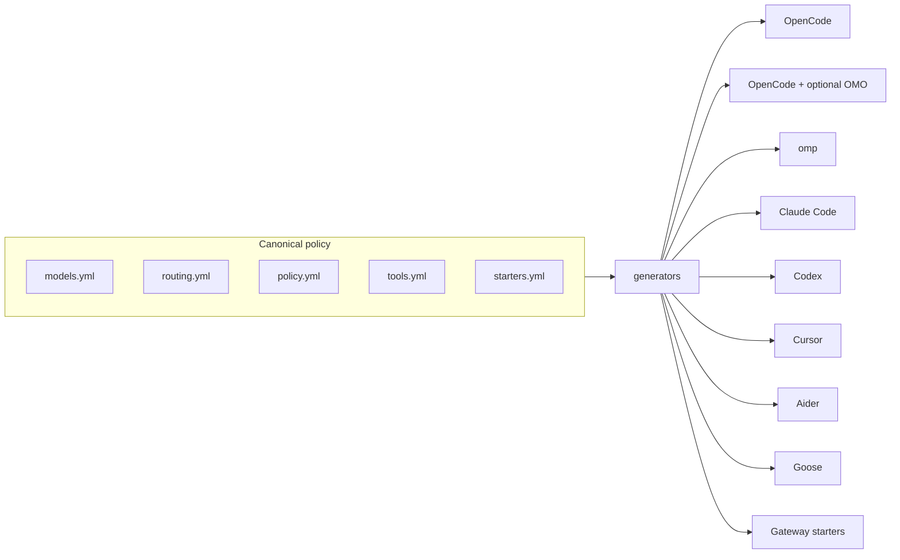

# Architecture

Universal Agent Config is a deterministic translation layer, not a runtime dependency.

## Canonical files

| File | Responsibility |
| --- | --- |
| `core/models.yml` | Model metadata, context/output limits, capabilities, provider routing, and pricing |
| `core/routing.yml` | Named profiles and ordered lane fallbacks |
| `core/policy.yml` | Permissions, safety, timeouts, concurrency, compaction, and telemetry |
| `core/providers.yml` | Model and media provider taxonomy plus OpenRouter transport |
| `core/gateways.yml` | Routing technology comparison and gateway semantics |
| `core/tools.yml` | Tool/MCP/plugin contract, provider semantics, logging, and redaction |
| `core/starters.yml` | Opinionated lanes and adapter-specific role translation |
| `core/prompts/core.md` | Shared agent behavior and verification policy |

The generated directories are artifacts. Never edit them manually; edit canonical files and regenerate.

## Generation pipeline

1. `scripts/refresh_models.py` reads the live OpenRouter catalog and updates canonical model metadata.
2. `scripts/generate.py` clears and rebuilds `generated/`.
3. Each generator translates the same canonical policy into one agent's native schema.
4. `scripts/validate.py` checks model references, permissions, telemetry, gateway artifacts, and adapter expectations.
5. Tests verify deterministic output and sandboxed installer behavior.

This makes an adapter change auditable: the diff shows both canonical policy and the exact generated native files.

## Design rules

- Native first: output must look like normal config for the target agent.
- No runtime lock-in: generated configs do not need this repository unless deliberately linked.
- One policy: adapters cannot introduce private behavior absent from `core/`.
- Conservative defaults: telemetry off, secrets local, destructive actions confirmed.
- Evidence over guesses: unsupported config keys are not invented.
- Model facts are time-sensitive and must be refreshed from the catalog before making live claims.

## Web generator

`web/` is a client-only Next.js 16 App Router application. It is not a runtime dependency for generated configs.

- `web/scripts/sync-catalog.mjs` converts canonical YAML into `web/src/data/catalog.json`.
- `web/src/lib/` contains typed catalog, configuration, validation, and generator logic.
- `web/src/app/(generator)/page.tsx` is the sole public route and keeps SEO metadata in the server layer.
- `web/src/components/generator-studio.tsx` is the client boundary for wizard state, preview, copy, and ZIP download.

The app collects no keys, has no API route, and requests no external CDN assets at runtime.

### Provider-level hosting path

The public app stays client-only. A self-hosted deployment can evolve the same policy model into an organization's provider layer:

1. host the Next.js app and canonical catalog in a private container;
2. connect it to a self-hosted gateway such as LiteLLM Proxy or Cloudflare AI Gateway;
3. expose an internal catalog, policy validation, and artifact generation service;
4. distribute generated defaults to developer machines and repositories;
5. centralize versioning, drift detection, audit, and rollback.

That path requires authentication, tenancy, gateway credentials, runtime observability, and deployment controls that are deliberately absent from the public app.
